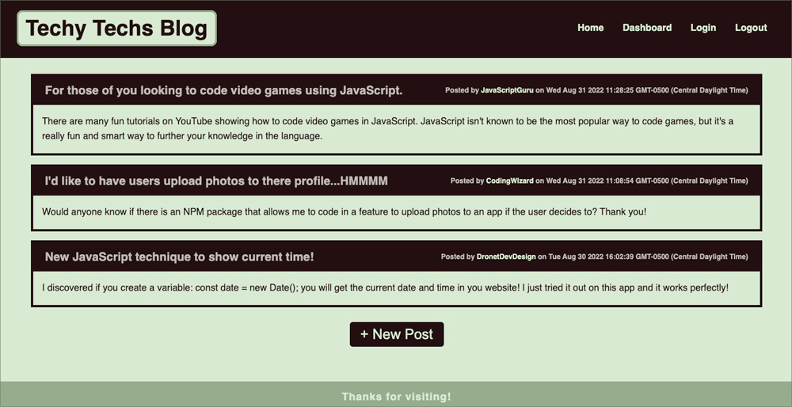

# Techy Techs Blog
## A blog for coders who like to get technical about subjects pertaining to programming

## Purpose:
The Techy Techs Blog is a fun way to get the latest trends, questions and solutions about programming languages. Sign up and get a profile by creating a username, your email address and a password! It's extremely easy to use!

## Heroku App Link:
## https://techy-techs-blog.herokuapp.com/

 

## **Table of contents:**
  * [Installation](#installation)
  * [Start](#start)
  * [Usage](#usage)
  * [Contribute](#contribute)
  * [Questions](#questions)

 

     

 

 

## This Full-stack App Was Created Using:
* HTML
* CSS
* JavaScript
* NodeJS
* MySQL/MySQL2
* Sequelize
* Express
* Express-handlebars
* Express-session
* Connect-session-sequelize
* Bcrypt
* Insomnia
* Dotenv package
* Heroku
* GitHub

 

## Installation:
  ### *To install all packages use this command in the the terminal:*
  ### npm i

 

## Start:
  ### *To start use this command in the the terminal => then use http://localhost:3001/ in the browser:*
  ### npm start

 

## Usage:
  ### The respository can be cloned and placed in a folder remotely.

 

## Contribute:
### Please contact me regarding contributing to this repository. All additions must be approved.

 

## Questions?
### *If you have any questions here's how to contact me:*
* Username: DronetDevDesign
* Repository: https://github.com/DronetDevDesign
* Email: ron@DronetDevDesign.com

